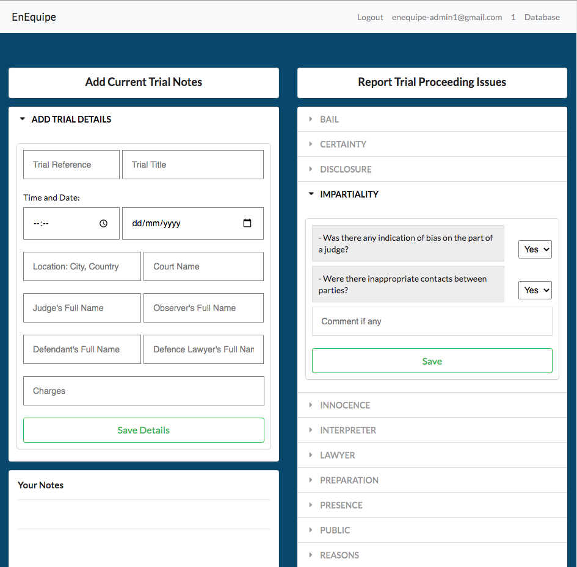

# Criminal_Trial_Monitor
A tool developed for a Law Charity organisation to monitor criminal trials
## What
I was asked by a lawyer working for a Law Charity (name not to be mentioned) if I could build this tool. 
The requirements of the web application were: 
- Be able to help a 'Trial Monitor' quickly check if the trial proceedings follow international laws (live). 
- Enable quick note taking and saving
- Be able to funciton offline and online (many trials in the world happen in places that might not have internet access)
- Synchronization of the local and cloud database as soon as the device can access internet
- An admin backend to manage data from all trial monitorings
- Trial Monitor(user) and Admin login 
## Stack and Tech
- Database: CouchDB, PouchDB (to enable Offline-first feature)
- Node.js
- Express.js
- View templating: EJS (embedded javascript)
- Login: Passport.js
## Home screen

## Usage
Please feel free to use this repo as a guide to learn basic Offline-first app development.  
DO NOT: copy and reuse the code as is for any for-profit activity.  
I encourage you to point out as many errors and shorcomings in the code as possible. Thanks :)
